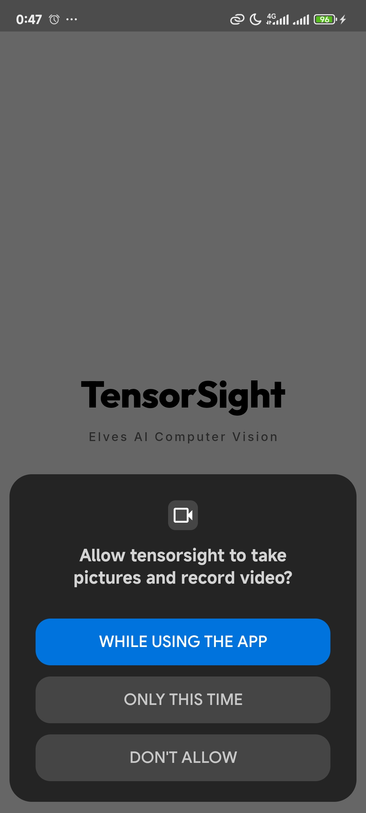
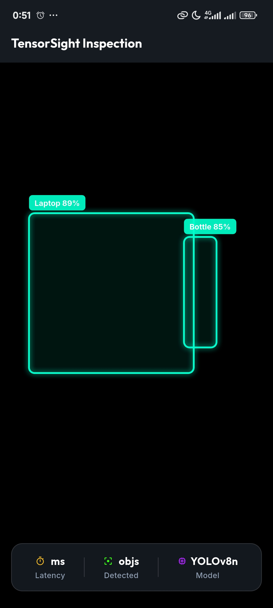

# 👁️ TensorSight

**Offline-first, real-time object detection — 100% on-device, zero cloud calls.**


<p align="start">
    &nbsp; &nbsp; 
   &nbsp; &nbsp; 
  
</p>


---

## The Problem

Most "AI camera" features — Google Lens, retail scanners, ID scanners in banking apps — send every frame to a server to run detection. That means no internet, no feature; every frame leaving the device; and latency at the mercy of the network.

## The Use Case

TensorSight is for situations where an app needs to recognize objects through the camera **without connectivity or a cloud bill**:

- Fieldwork, logistics, and inspection apps used in areas with poor or no signal
- Privacy-first tools where camera data should never leave the phone
- Any product that can't justify a recurring per-inference API cost
- A learning reference for anyone building a Flutter + on-device ML camera pipeline on Android

## The Solution

TensorSight runs a quantized **YOLOv8n** model directly on the Android device via ONNX Runtime. Point the camera at a scene and get live bounding boxes across all **80 COCO classes**, fully offline, with real-time latency and object-count telemetry shown on screen.

## Getting Started (Android)

```bash
git clone https://github.com/Elvisnc9/TensorSight-Mobile.git
cd TensorSight-Mobile
flutter pub get
flutter run
```

Requires this proguard rule in `android/app/proguard-rules.pro`:

```
-keep class ai.onnxruntime.** { *; }
```

## License

MIT — see [`LICENSE`](LICENSE) for details.